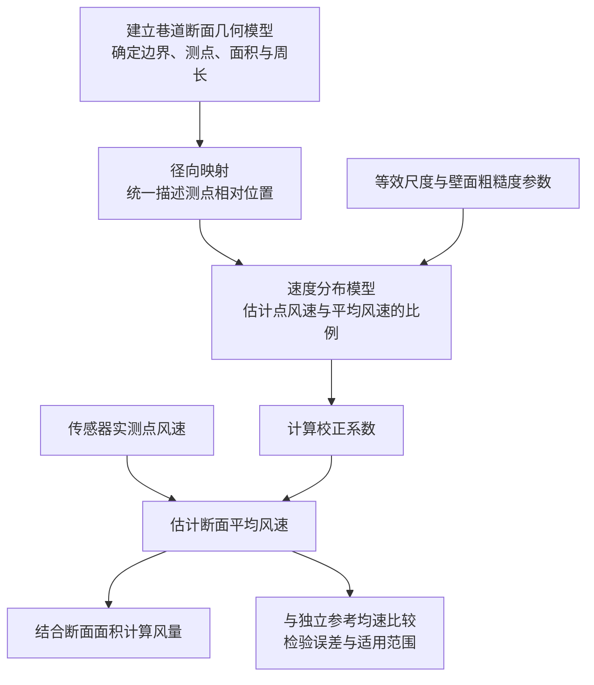

# 巷道风速校正项目介绍（讨论草稿）

> 本稿汇总目前已确认的背景、意义和技术路线，作为后续逐段修改的基础。实验结果与局限部分尚待讨论。  
> 整体汇报目标为10分钟；背景暂按约3分钟组织，其余部分待内容确定后统一调整时长。

## 一、项目背景

### 1. 矿井巷道为什么要测风

矿井巷道需要测风，主要有两个方面的原因。

首先，是保障井下人员的呼吸、健康和作业安全。矿井地下空间的空气交换受到限制，需要通过通风持续送入新鲜空气，稀释和排出瓦斯等有害气体，配合粉尘防治，并改善井下温度和湿度条件。但风机正常运行，并不意味着各个作业地点都得到了足够的风量。因此，必须通过测风掌握巷道实际的风速和风量，检查通风是否满足需要。

其次，测风也是法规规定的管理要求。以煤矿为例，新版《煤矿安全规程》要求建立测风制度，每旬至少进行一次全面测风；对采掘工作面和其他用风地点，还应根据实际需要随时测风。测风数据是检查供风情况、调整风量和开展通风管理的重要依据。[1]

### 2. 现有主要的测风手段

目前，现场测风可以从人工测风和固定传感器测风两种方式来介绍。

**人工测风**通常由测风人员携带机械风表或电子风表，在选定断面进行测量。常见方式包括定点测风和线路测风：前者按规定选取位置进行测量；后者沿规定路线移动风表，覆盖断面不同区域，估计断面平均风速，再结合断面面积计算风量。这种方式能够获得断面测量结果，但需要人员到场，通常按一定周期开展。[2]

**传感器测风**则通过固定安装的装置采集风速，可采用叶轮式、热式或超声波等测量原理。[3][4]

- 叶轮式：利用气流推动叶轮旋转，通过转速与风速的对应关系获得风速。
- 热式：利用气流对加热元件的冷却作用，通过热量变化推算风速。
- 超声波式：利用声波传播受气流影响产生的差异，获得相应方向的速度信息。

其中，本项目重点关注固定单点巷道风速传感器：它安装在巷道某个位置，持续采集并上传风速，便于观察风速随时间的变化。

### 3. 单点巷道传感器测风的局限性

单点测风存在一个关键局限：**它测得的是局部风速，而计算巷道风量需要的是断面平均风速。**

巷道断面内的速度并不均匀，壁面附近、断面内部和角部的风速可能不同。因此，即使传感器准确测出了所在位置的风速，也不能保证这个读数能够代表整个断面。如果直接将单点风速乘以断面面积，就可能使风量估计产生偏差。

同时，对单点读数进行长时间平均，虽然能够减弱瞬时波动，却不能自动消除测点位置带来的代表性偏差。**时间上连续、读数上稳定，并不等于空间上具有代表性。**

因此，本项目研究的出发点，就是结合巷道断面和测点位置，建立局部风速与断面平均风速之间的转换关系，让固定测点持续获得的数据，能够更合理地用于巷道风量估计。

## 二、项目意义

项目意义集中在两个层次：先提高单条巷道的风量估计可靠性，再为整个矿井通风网络的计算与调节提供数据支持。

### 1. 提高由单点风速估计断面平均风速和风量的可靠性

固定风速传感器直接测得的是局部风速，其与断面平均风速之间存在位置相关的差异。如果直接用单点风速计算风量，这种差异就会传递到风量估计中。

风速校正通过考虑巷道断面形状、测点位置及速度分布关系，建立点风速与断面平均风速之间的转换关系。在模型适用且经过验证的条件下，可以减少测点代表性不足带来的偏差，提高巷道平均风速与风量估计的可靠性。

### 2. 为通风网络解算与风量调节提供更准确的数据依据

单条巷道的风量估计，是认识整个矿井通风网络运行状态的基础之一。校正后的风量数据，可以用于检查网络解算结果、校核模型参数，并支持网络运行状态的更新，使计算结果更接近实际通风情况。

在此基础上，才能更合理地分析各分支的风量分配，判断用风地点的供风情况，并评价风量调节方案的效果。因此，风速校正的进一步价值，是为通风网络解算、状态判断和调节决策提供更可靠的数据支撑。

> 表述说明：在不同网络解算方法中，风量可能作为约束、校核数据或参数反演依据，并不都是直接输入量。本文统一使用“为通风网络解算与校核提供数据依据”的表述；这些是校正结果的下游用途，不表示当前原型已经实现完整通风网络解算功能。

## 三、技术路线

项目首先处理不同形状的巷道，再判断测点风速与断面平均风速之间的关系，最后完成校正并检验结果。具体分为五个环节。

### 1. 根据实际尺寸，建立巷道断面的几何模型

首先输入巷道的断面类型、尺寸和传感器安装位置，在模型中还原断面边界，并确定测点的位置，同时计算断面面积和周长。

这一步的作用，是把实际巷道转化为可以计算的几何对象。因为同样一个测点坐标，放在不同尺寸、不同形状的巷道中，与壁面的距离和在断面中的位置都可能不同，不能直接使用同一个校正系数。

### 2. 通过径向映射，统一描述测点在不同断面中的位置

建立断面后，选取一个参考中心，从中心经过测点向外延伸，找到这条射线与巷道边界的交点。然后比较“中心到测点的距离”与“中心到边界的距离”，得到测点的相对径向位置。

例如，相对径向位置为0.8，表示沿着这个方向，测点位于从中心到边界距离的80%处。

这一步的技术思路是：**不同巷道的边界形状虽然不同，但都可以用“测点沿所在方向有多接近边界”来描述位置。**这样，就能够把矩形、拱形和梯形等断面接入统一的速度计算框架。

这里的参考中心用于几何计算，并不意味着它一定是真实风速最大的地方。

### 3. 结合速度分布模型，估计测点风速与断面平均风速的比例

知道测点处于什么位置后，还需要判断这个位置的风速通常比平均值快多少或慢多少。

项目结合断面面积、周长得到的等效尺度，以及壁面粗糙度参数，将测点的相对径向位置代入对数形式的速度分布模型，计算“点风速与断面平均风速之比”。

这一环节把几何信息转化为速度关系：**径向映射回答“测点在哪里”，速度模型回答“这个位置的风速与平均值是什么关系”。**

同时，这也是模型的主要近似：在同一个断面、同一组参数下，相对径向位置相同的点，会被赋予相同的速度比。

### 4. 由速度比得到校正系数，完成点速到均速、风量的转换

如果模型判断某个位置的风速高于断面平均值，就需要将测得的点风速向下校正；如果低于平均值，就需要向上校正。

例如，假设模型估计该位置的风速是平均风速的1.1倍，就应将测得的风速除以1.1，得到平均风速的估计值。这个例子只是说明转换过程，不代表固定采用某个系数。

得到断面平均风速后，再结合第一步计算的断面面积，得到巷道风量。最终输出不仅包括风量，还包括校正系数和平均风速，便于检查计算依据。

### 5. 用独立参考数据，检验这套转换是否准确

完成计算流程后，需要用已知局部风速和断面平均风速的数据进行验证：把局部风速作为模型输入，将校正结果与独立参考均速比较。

通过比较不同测点、不同工况下的误差，判断模型在哪些条件下有效，以及哪些位置需要改进。这样，才能把“程序能够算出结果”进一步推进到“计算结果具有可验证的可靠性”。

**技术路线概览：**

整条技术路线的核心，是先用几何映射处理断面形状差异，再用速度分布模型建立转换关系，最后将传感器的局部读数转化为断面平均风速和风量估计。

## 四、实验结果与局限〔待完善〕

本节尚未形成确认稿。后续拟结合实际验证报告，讨论以下内容：

1. 数据来源、测试工况与参考均速的获取方式。
2. 校正效果：区分均速线检验与区域误差，必要时对比校正前后结果。
3. 结果适用范围：区分规则方管数值基准与矿井现场条件。
4. 模型局限与后续验证方向。

已有支撑材料：[方管DNS模型验证报告](validation/airflow_dns_validation_20260920/方管DNS模型验证报告.md)。

---

## 资料来源与编写说明

以下来源用于核查背景中的法规和测量手段，口头讲解时无需逐项读出。

1. [国家矿山安全监察局安徽局：政务咨询与新版测风制度解释](https://ah.chinamine-safety.gov.cn/fuwu/hd_zwzx/index.html)。法规表述针对煤矿，不直接外推为所有矿山的同一要求。
2. [国家矿山安全监察局公开测风操作资料](https://www.chinamine-safety.gov.cn/zfxxgk/fdzdgknr/tzgg/202409/W020240910350561640674.pdf)。
3. [美国矿业局：Measurement of Air Velocity in Mines](https://stacks.cdc.gov/view/cdc/201771)。
4. [NIOSH：矿井风流测量与超声波风速仪研究](https://www.cdc.gov/niosh/engcontrols/ecd/detail114.html)。

本稿以已讨论确认的内容为基础，不将预期应用价值写成已经验证的现场收益，不将网络解算列为当前校正原型已实现的功能。实验部分完成后，再统一删节和分配10分钟的讲解时间。
